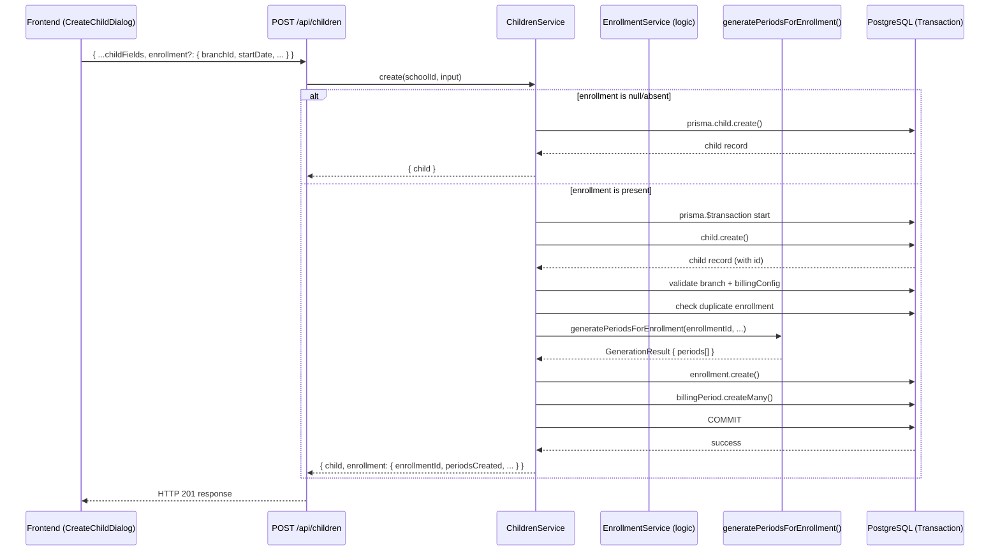

# Design Document: Auto-Enrollment at Child Creation

## Overview

This design extends the existing child creation flow (POST /api/children) to optionally create a payment Enrollment and its associated BillingPeriods atomically alongside the child record. The change is additive — when enrollment fields are absent, behavior is identical to today.

The key architectural decision is to wrap the existing `childrenService.create()` in a Prisma `$transaction` when enrollment data is present, and delegate billing period generation to the same `enrollmentService` logic already used by POST /api/payments/enrollments. This ensures billing consistency between both creation paths.

On the frontend, the CreateChildDialog gains a collapsible "Payment Enrollment" section that, when toggled on, adds branch selection, start date, and optional fee override fields. The section is hidden by default, preserving the current fast path for child-only registration.

---

## Architecture



### Design Decisions

1. **Single transaction boundary**: The `$transaction` wraps child creation + enrollment creation + period inserts. If any step fails, the entire operation rolls back — no orphaned children or partial enrollments.

2. **Reuse enrollment logic, not service method**: Rather than calling `enrollmentService.create()` (which manages its own transaction), we extract the validation and generation logic into a reusable internal function. This avoids nested transactions and keeps the code testable.

3. **Schema extension via optional nested object**: The `createChildSchema` gains an optional `enrollment` field validated with Zod. This keeps the API surface clean and backward-compatible.

4. **Branch list filtering on frontend**: The branch dropdown only shows branches with active billing configs. This is fetched from the existing `/payments/branches` endpoint which already returns config status.

---

## Components and Interfaces

### Backend

#### Extended Schema (`children.schema.ts`)

```typescript
// New: optional enrollment sub-schema within createChildSchema
const childEnrollmentSchema = z.object({
  branchId: z.string().uuid('Invalid branch ID'),
  startDate: z.coerce.date({ required_error: 'Start date is required' }),
  recurringFee: decimalAmount(0, 9999999.99).optional(),
  registrationFee: decimalAmount(0, 9999999.99).nullish(),
  firstPeriodAmountDue: decimalAmount(0, 9999999.99).optional(),
});

export const createChildSchema = z.object({
  firstName: z.string().min(1).max(255),
  lastName: z.string().min(1).max(255),
  dateOfBirth: z.string().regex(/^\d{4}-\d{2}-\d{2}$/),
  gender: z.enum(['male', 'female']),
  enrollmentDate: z.string().regex(/^\d{4}-\d{2}-\d{2}$/),
  academicYearId: uuidSchema,
  enrollment: childEnrollmentSchema.nullish(), // NEW: optional enrollment payload
});
```

#### ChildrenService — Extended `create()` Method

```typescript
interface CreateChildWithEnrollmentResult {
  child: ChildWithEnrollments;
  enrollment?: EnrollmentGenerationResult;
}

class ChildrenService {
  async create(
    schoolId: string,
    input: CreateChildInput
  ): Promise<CreateChildWithEnrollmentResult> {
    // If no enrollment payload, use existing simple path
    if (!input.enrollment) {
      const child = await prisma.child.create({ ... });
      return { child };
    }

    // With enrollment: run everything in a single transaction
    return await prisma.$transaction(async (tx) => {
      // 1. Validate academic year
      // 2. Create child record
      // 3. Validate branch + billing config
      // 4. Check duplicate enrollment (childId + academicYearId)
      // 5. Default recurringFee from config if not provided
      // 6. Validate firstPeriodAmountDue constraints
      // 7. Fetch BranchCalendar rows (trimester/custom)
      // 8. Create Enrollment record
      // 9. generatePeriodsForEnrollment()
      // 10. Bulk-insert BillingPeriods
      // Return { child, enrollment: generationResult }
    });
  }
}
```

#### Controller Response Shape

```typescript
// When enrollment is present:
{
  success: true,
  data: {
    ...childRecord,
    enrollment: {
      enrollmentId: string,
      periodsCreated: number,
      earliestPeriodStart: Date,
      latestPeriodEnd: Date,
      totalAmountDue: Decimal
    }
  }
}

// When enrollment is absent (backward compatible):
{
  success: true,
  data: { ...childRecord }
}
```

### Frontend

#### Updated `useCreateChild` Hook

```typescript
interface CreateChildPayload {
  first_name: string;
  last_name: string;
  date_of_birth: string;
  gender: string;
  enrollment_date: string;
  academic_year_id: string;
  enrollment?: {
    branchId: string;
    startDate: string;
    recurringFee?: number;
    registrationFee?: number | null;
    firstPeriodAmountDue?: number;
  };
}
```

#### Updated CreateChildDialog Component

- Adds a toggle/switch labeled "إعداد الدفع" / "Payment Enrollment" below existing fields
- When toggled on, reveals:
  - Branch selector (dropdown, only branches with billing config)
  - Start date (date input, defaults to enrollment_date)
  - Recurring fee (number input, pre-filled from branch config)
  - Registration fee (optional number input)
- When toggled off, enrollment object is excluded from payload
- Validation errors from backend are mapped to the specific field

#### New Hook: `useBranchesWithConfig`

Reuses the existing `/payments/branches` endpoint, filtering to only branches with `billingConfig` present. This hook is used exclusively by the enrollment section of CreateChildDialog.

---

## Data Models

No schema changes are required to the database. The feature uses existing Prisma models:

- **Child** — created as before
- **Enrollment** — created with `childId` from the newly-created child, reusing the existing `@@unique([childId, academicYearId])` constraint for duplicate detection
- **BillingPeriod** — bulk-created from `generatePeriodsForEnrollment()` output
- **Branch** + **BranchBillingConfig** — read for validation and fee defaults
- **BranchCalendar** — read for trimester/custom billing cycles

### Data Flow

```
Input: { childFields, enrollment: { branchId, startDate, recurringFee?, ... } }
                         │
                         ▼
              ┌──────────────────────┐
              │ prisma.$transaction  │
              │                      │
              │ 1. child.create()    │──► Child record (id generated)
              │ 2. enrollment.create │──► Enrollment record (child.id + branch + AY)
              │ 3. billingPeriod.    │
              │    createMany()      │──► N BillingPeriod records
              └──────────────────────┘
                         │
                         ▼
Output: { child, enrollment: { enrollmentId, periodsCreated, totalAmountDue, ... } }
```

---

## Correctness Properties

*A property is a characteristic or behavior that should hold true across all valid executions of a system — essentially, a formal statement about what the system should do. Properties serve as the bridge between human-readable specifications and machine-verifiable correctness guarantees.*

### Property 1: Backward compatibility — absent enrollment preserves existing behavior

*For any* valid child creation input where the `enrollment` field is absent or null, the system SHALL produce exactly the same child record (same fields, same response shape) as the current implementation without any enrollment-related side effects.

**Validates: Requirements 1.2, 7.3**

### Property 2: Atomicity — transaction all-or-nothing

*For any* child creation input with a valid enrollment object, if the enrollment creation step fails (e.g., missing billing config, duplicate enrollment), the database SHALL contain neither the child record nor any enrollment or billing period records from that request.

**Validates: Requirements 2.1, 2.2**

### Property 3: Billing period generation equivalence

*For any* valid enrollment parameters (branchId, startDate, academicYearId, recurringFee, registrationFee, firstPeriodAmountDue), the BillingPeriods generated via the auto-enrollment path SHALL be identical in count, boundaries (periodStart, periodEnd), dueDates, graceEndDates, and amountDue values to those generated by calling `generatePeriodsForEnrollment()` directly with the same input parameters.

**Validates: Requirements 4.1, 4.2**

### Property 4: Duplicate enrollment prevention

*For any* child and academic year combination where an Enrollment already exists, attempting to create another child with enrollment for the same academic year SHALL be rejected with HTTP 409, and the database SHALL remain unchanged.

**Validates: Requirements 5.1, 5.2**

### Property 5: Fee defaulting from branch config

*For any* enrollment payload where `recurringFee` is not provided, the generated Enrollment record's `recurringFee` SHALL equal the `defaultRecurringFee` from the Branch's BillingConfig, and all recurring BillingPeriods SHALL use that same value as `amountDue`.

**Validates: Requirements 3.4**

### Property 6: Enrollment response structure completeness

*For any* successful child creation with enrollment, the response SHALL contain both the child object and an enrollment summary with all required fields (enrollmentId, periodsCreated, earliestPeriodStart, latestPeriodEnd, totalAmountDue), where periodsCreated equals the actual count of BillingPeriod records created in the database.

**Validates: Requirements 7.1, 7.2**

---

## Error Handling

| Condition | HTTP Status | Error Code | Message |
|-----------|-------------|------------|---------|
| `enrollment.branchId` not found | 404 | NOT_FOUND | "Branch not found" |
| Branch has no BillingConfig | 422 | GENERATION_FAILED | "Branch has no billing configuration. Please configure billing before creating enrollments." |
| `enrollment.startDate` missing/invalid | 400 | VALIDATION_ERROR | Zod validation error for startDate |
| `firstPeriodAmountDue` provided but startDate ≤ first period start | 400 | VALIDATION_ERROR | "A first-period amount may only be stated when start_date is later than the first billing period start" |
| Duplicate enrollment (child + AY) | 409 | CONFLICT | "An enrollment already exists for this child in the specified academic year" |
| No BranchCalendar rows for trimester/custom | 422 | GENERATION_FAILED | "Custom/Trimester billing cycle requires calendar rows..." |
| Academic year not found | 404 | NOT_FOUND | "Academic year not found or does not belong to this school" |
| Child creation fails (name validation, etc.) | 400 | VALIDATION_ERROR | Standard Zod validation messages |

### Error Propagation Strategy

- Enrollment errors within the transaction bubble up as `EnrollmentServiceError` or `ChildServiceError` and cause a full rollback.
- The controller maps error instances to appropriate HTTP responses using the same pattern as existing endpoints.
- Frontend displays backend error messages inline next to the relevant field when possible (branch, startDate, fee fields), or as a form-level alert for general errors.

---

## Testing Strategy

### Unit Tests (Example-Based)

- Child creation without enrollment returns only child record (backward compat)
- Child creation with enrollment returns child + enrollment summary
- Missing branchId returns 400 validation error
- Non-existent branch returns 404
- Branch without billing config returns 422
- Duplicate enrollment returns 409
- Transaction rollback when enrollment fails mid-way (verify no child in DB)
- Frontend toggle state: collapsed section excludes enrollment from payload
- Frontend toggle state: expanded section includes enrollment in payload

### Property-Based Tests

Property tests use `fast-check` with minimum 100 iterations per property.

- **Property 3 (billing equivalence)**: Generate random valid enrollment params (varying billing cycles, start dates, fee amounts, calendar rows) and verify that `generatePeriodsForEnrollment()` produces identical output whether called from the auto-enrollment path or directly.
- **Property 5 (fee defaulting)**: Generate random BranchBillingConfig `defaultRecurringFee` values and verify that omitting `recurringFee` from the enrollment payload always results in periods using the config default.
- **Property 1 (backward compatibility)**: Generate random valid child inputs without enrollment and verify the response shape matches the current contract exactly.

### Integration Tests

- End-to-end: POST /api/children with enrollment → verify child, enrollment, and billing periods all exist in DB
- End-to-end: POST /api/children with enrollment on trimester branch → verify 3 periods generated
- End-to-end: Transaction rollback scenario with duplicate enrollment → verify DB is clean

### Test Configuration

Each property-based test is tagged with:
```
// Feature: auto-enrollment-at-child-creation, Property {N}: {description}
```

Library: `fast-check` (already available in project via vitest ecosystem)
Minimum iterations: 100 per property test
