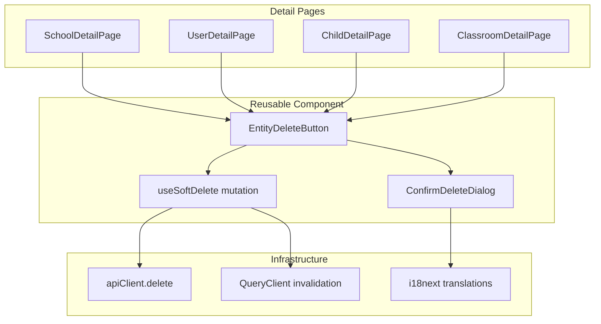

# Design Document: Entity Delete Buttons

## Overview

This feature adds a reusable soft-delete button component (`EntityDeleteButton`) to the admin panel detail pages for Schools, Users, Children, and Classrooms. The component encapsulates a danger-styled button, a confirmation dialog, a TanStack Query mutation, loading/error states, and post-deletion navigation — all behind a single React component with a minimal props interface.

The backend already provides a `SoftDeleteService` that sets `deletedAt` on any of the four core entity models. Each entity module already exposes a `DELETE /api/{entity}/:id` endpoint that delegates to this service. The frontend work is purely UI: replacing existing inline delete logic with the new reusable component and adding the missing translation keys.

### Design Decisions

1. **Single component, not a hook + component split** — The confirmation dialog, mutation, and button are tightly coupled. Splitting them would force consumers to manage dialog open state externally, which defeats the "drop-in" goal.
2. **Navigation via callback prop** — Each detail page has different list routes (`/admin/schools`, `/admin/children`, etc.). A callback keeps the component route-agnostic.
3. **Inline error display inside dialog** — Errors show inside the still-open dialog rather than as a page-level toast. This keeps the user's attention on the action that failed and lets them retry without re-opening the dialog.
4. **Leverage existing `Dialog` component** — The project already has a `Dialog`/`DialogContent`/`DialogFooter` component set. The confirmation dialog will compose these rather than introducing a new modal primitive.

---

## Architecture



The `EntityDeleteButton` is a self-contained component that:
1. Renders a danger-styled button with trash icon and localized label
2. On click, opens an internal `ConfirmDeleteDialog`
3. On confirm, fires a TanStack Query `useMutation` calling `apiClient.delete(`/${entityType}/${entityId}`)`
4. On success, invalidates relevant query keys and invokes the `onDeleted` navigation callback
5. On error, displays the error inline inside the dialog and re-enables buttons

---

## Components and Interfaces

### EntityDeleteButton

**File:** `frontend/src/components/ui/EntityDeleteButton.tsx`

```typescript
interface EntityDeleteButtonProps {
  /** Plural entity type matching API route segment */
  entityType: 'schools' | 'users' | 'children' | 'classrooms';
  /** UUID of the entity to delete */
  entityId: string;
  /** Human-readable name shown in confirmation dialog */
  entityDisplayName: string;
  /** Called after successful deletion — typically navigates to list page */
  onDeleted: () => void;
  /** If true, the button is not rendered (e.g., entity already deleted) */
  hidden?: boolean;
}
```

**Behavior:**
- Renders a `<Button variant="danger">` with `<Trash2>` icon and `t('common.softDelete.button')` label
- If `hidden` is true, renders nothing
- Manages internal state: `dialogOpen`, `error`
- Clears `error` state when dialog is re-opened (new attempt)

### ConfirmDeleteDialog (internal)

Composed inside `EntityDeleteButton`, not exported. Uses the existing `Dialog`, `DialogContent`, `DialogHeader`, `DialogTitle`, `DialogDescription`, `DialogFooter` components.

**Dialog content:**
- Title: `t('common.softDelete.dialogTitle')`
- Warning message: `t('common.softDelete.dialogWarning', { entityType: t(`common.entityTypes.${entityType}`), entityName: entityDisplayName })`
- Error message (conditional): displayed in a danger alert card when mutation fails
- Footer: Cancel button + Confirm button (danger variant)

**Loading state:**
- Both buttons disabled
- Confirm button shows a spinner icon
- Dialog `onOpenChange` is blocked (cannot close via Escape or overlay click)

### useSoftDelete (internal hook)

```typescript
function useSoftDelete(entityType: EntityType) {
  const queryClient = useQueryClient();

  return useMutation({
    mutationFn: async (entityId: string) => {
      const res = await apiClient.delete(`/${entityType}/${entityId}`);
      if (!res.success) throw new Error(res.error?.message ?? 'Delete failed');
      return res.data;
    },
    onSuccess: () => {
      // Invalidate list queries for this entity type
      queryClient.invalidateQueries({ queryKey: [entityType] });
      // Also invalidate trash queries so trash view updates
      queryClient.invalidateQueries({ queryKey: ['trash', entityType] });
    },
  });
}
```

### Query Key Invalidation Map

| Entity Type  | Invalidated Keys                          |
|-------------|-------------------------------------------|
| schools     | `['schools-list']`, `['trash', 'schools']` |
| users       | `['users']`, `['trash', 'users']`          |
| children    | `['children']`, `['trash', 'children']`    |
| classrooms  | `['classrooms']`, `['trash', 'classrooms']`|

### Integration Points (Detail Pages)

Each detail page adds the component in its appropriate section:

| Page                | Placement                                      | `onDeleted` target       |
|---------------------|------------------------------------------------|--------------------------|
| SchoolDetailPage    | Inside "Access Control" card, below toggle     | `/admin/schools`         |
| UserDetailPage      | In actions bar alongside activate/deactivate   | `/admin/users`           |
| ChildDetailPage     | Danger zone section (replaces old delete)      | `/admin/children`        |
| ClassroomDetailPage | Danger zone section (replaces old delete)      | `/admin/classrooms`      |

The `hidden` prop is set to `true` when the entity's `deletedAt` is non-null (already soft-deleted).

---

## Data Models

No new database models are introduced. The feature uses existing models and their `deletedAt` column (added in migration `0007_soft_deletion`).

### Translation Keys (added to `common.json`)

```json
{
  "common": {
    "softDelete": {
      "button": "Delete",
      "dialogTitle": "Confirm Deletion",
      "dialogWarning": "You are about to delete this {{entityType}} ({{entityName}}). It will be hidden from normal views but can be restored later from the Trash.",
      "dialogConfirm": "Delete",
      "dialogCancel": "Cancel",
      "success": "{{entityType}} deleted successfully",
      "errorAlreadyDeleted": "This {{entityType}} has already been deleted",
      "errorNotFound": "This {{entityType}} was not found",
      "errorGeneric": "Failed to delete. Please try again."
    },
    "entityTypes": {
      "schools": "school",
      "users": "user",
      "children": "child",
      "classrooms": "classroom"
    }
  }
}
```

Arabic translations follow the same key structure in `ar/common.json` with RTL-appropriate text.

### API Endpoints (existing, no changes)

| Method | Endpoint               | Response (success)                     | Response (error)                        |
|--------|------------------------|----------------------------------------|-----------------------------------------|
| DELETE  | `/api/children/:id`   | `{ success: true, data: { message } }` | `{ success: false, error: { code, message } }` |
| DELETE  | `/api/classrooms/:id` | `{ success: true, data: { message } }` | `{ success: false, error: { code, message } }` |
| DELETE  | `/api/users/:id`      | `{ success: true, data: { message } }` | `{ success: false, error: { code, message } }` |
| DELETE  | `/api/schools/:id`    | `{ success: true, data: { message } }` | `{ success: false, error: { code, message } }` |

Error codes: `NOT_FOUND` (404), `ALREADY_DELETED` (409), `SOFT_DELETE_ERROR` (400).

---

## Correctness Properties

*A property is a characteristic or behavior that should hold true across all valid executions of a system — essentially, a formal statement about what the system should do. Properties serve as the bridge between human-readable specifications and machine-verifiable correctness guarantees.*

### Property 1: Hidden when already deleted

*For any* entity type and any entity object where `deletedAt` is non-null, the `EntityDeleteButton` component should render nothing (return null).

**Validates: Requirements 1.6**

### Property 2: Confirmation dialog displays entity identity

*For any* entity type (one of "schools", "users", "children", "classrooms") and any non-empty display name string, the rendered confirmation dialog warning message should contain both the localized entity type label and the display name.

**Validates: Requirements 2.2**

### Property 3: Error prevents navigation and displays message

*For any* error message string returned by the API, the component should display that error message within the dialog, keep the dialog open, re-enable both buttons, and NOT invoke the `onDeleted` callback.

**Validates: Requirements 2.7, 3.7**

### Property 4: Correct cache invalidation per entity type

*For any* entity type, when the soft-delete mutation completes successfully, the TanStack Query client should invalidate query keys matching that entity type's list queries and the corresponding trash queries.

**Validates: Requirements 3.6**

### Property 5: Translation completeness

*For any* required soft-delete translation key (button, dialogTitle, dialogWarning, dialogConfirm, dialogCancel, success, errorAlreadyDeleted, errorNotFound, errorGeneric, and all entityTypes keys), both the Arabic (`ar/common.json`) and French (`fr/common.json`) locale files should contain a non-empty string value for that key.

**Validates: Requirements 5.1**

### Property 6: Component renders for all valid prop combinations

*For any* valid entity type, any non-empty entity ID string, any non-empty display name string, and any callback function, the `EntityDeleteButton` component should render without throwing an error and produce a clickable button element.

**Validates: Requirements 6.1**

### Property 7: Error clears on retry

*For any* error state (where a previous deletion attempt failed and the error message is displayed), when the user initiates a new deletion attempt by clicking the confirm button again, the previous error message should be cleared before the new mutation fires.

**Validates: Requirements 6.2**

### Property 8: Navigation callback invoked exactly once on success

*For any* entity type and any provided `onDeleted` callback, when the soft-delete mutation completes successfully, the callback should be invoked exactly once.

**Validates: Requirements 3.5, 6.5**

---

## Error Handling

### Error Sources

| Source | Error | HTTP Code | User-Facing Behavior |
|--------|-------|-----------|---------------------|
| Backend | Entity not found | 404 | Show "not found" message in dialog, re-enable buttons |
| Backend | Entity already deleted | 409 | Show "already deleted" message, close dialog, refresh page state |
| Backend | Generic soft-delete error | 400 | Show generic error message in dialog, re-enable buttons |
| Network | Request timeout / connection failure | — | Show generic error message in dialog, re-enable buttons |
| Frontend | Invalid props (empty ID) | — | Component does not render the button (defensive guard) |

### Error Flow

1. Mutation `onError` callback receives the error
2. Error message is extracted from the API response or falls back to `t('common.softDelete.errorGeneric')`
3. For "already deleted" (409 with `ALREADY_DELETED` code): close dialog, show page-level notification, invalidate entity query to refresh state
4. For all other errors: keep dialog open, display error in a danger alert card above the footer, re-enable both buttons
5. On next confirm click, clear the error message before firing the mutation again

### Defensive Guards

- If `entityId` is empty/undefined, the button does not render
- If `entityType` is not one of the four valid values, TypeScript prevents compilation
- The confirm button is disabled while mutation is pending (prevents double-submit)
- Dialog close is blocked during pending mutation (prevents orphaned requests)

---

## Testing Strategy

### Unit Tests (example-based)

Focus on specific interactions and edge cases:

- **Rendering**: Button renders with correct icon and label in each locale
- **Placement**: Each detail page renders the `EntityDeleteButton` in the correct section
- **Dialog open/close**: Click opens dialog; cancel/Escape/overlay closes it
- **Loading state**: Buttons disabled and spinner shown during mutation
- **Success flow**: Dialog closes, navigation callback invoked
- **Already-deleted handling**: 409 response triggers page refresh behavior
- **RTL layout**: Component renders correctly with `dir="rtl"`
- **Hidden state**: Button not rendered when `hidden={true}`

### Property Tests (property-based)

Using **fast-check** as the PBT library. Minimum 100 iterations per property.

| Property | Generator Strategy |
|----------|-------------------|
| Property 1 (Hidden when deleted) | Generate random entity objects with non-null `deletedAt` dates, verify no button rendered |
| Property 2 (Dialog entity identity) | Generate random entity types × random Unicode display names, verify both appear in message |
| Property 3 (Error prevents navigation) | Generate random error message strings, verify error shown and callback not invoked |
| Property 4 (Cache invalidation) | Generate random entity types, verify correct query keys invalidated |
| Property 5 (Translation completeness) | Enumerate all required keys, verify both locale files have non-empty values |
| Property 6 (Renders for valid props) | Generate random valid entity types × UUIDs × display names × callbacks, verify renders |
| Property 7 (Error clears on retry) | Generate sequences of failed-then-retried attempts, verify error cleared |
| Property 8 (Navigation on success) | Generate random entity types × callbacks, verify callback invoked once on success |

**Tag format:** `Feature: entity-delete-buttons, Property {N}: {title}`

### Integration Tests

- End-to-end flow: click delete → confirm → verify API call → verify navigation
- Verify cache invalidation causes list page to exclude deleted entity
- Verify trash page shows newly deleted entity after navigation

