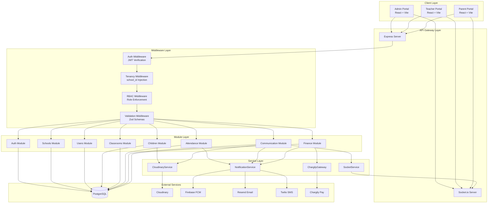
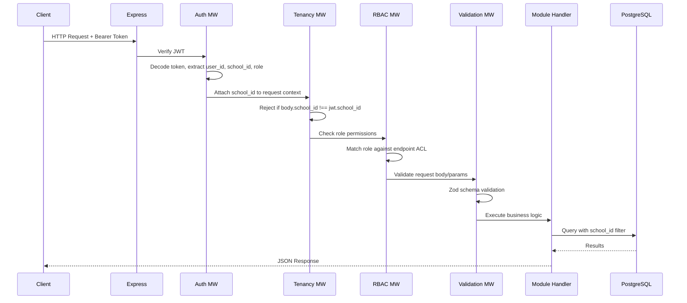
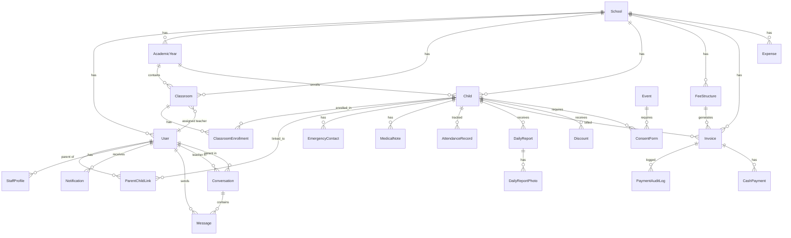

# Design Document: EduNest — Kindergarten School Management System

## Overview

EduNest is a multi-tenant fullstack web application for managing kindergartens in the Algerian market. The system provides three distinct portal experiences (Admin, Teacher, Parent) built on a shared backend architecture with Node.js/Express, React/Vite frontend, PostgreSQL database with Prisma ORM, and integrations with Chargily Pay (payments), Cloudinary (file storage), Firebase Cloud Messaging (push notifications), and Socket.io (real-time communication).

The architecture follows a modular monolith pattern organized into five core modules:
1. **School & User Management** — Authentication, RBAC, multi-tenancy, school/user/staff CRUD
2. **Children & Classrooms** — Learner records, enrollment, parent-child linking, medical notes
3. **Attendance** — Daily bulk marking, absence notifications, monthly reports
4. **Communication & Portal** — Real-time messaging, daily reports, announcements, events, consent
5. **Finance & Fees** — Fee structures, invoices, Chargily Pay + cash payments, discounts, expenses

### Key Design Decisions

| Decision | Choice | Rationale |
|----------|--------|-----------|
| Architecture | Modular monolith | Simpler deployment for MVP; modules can be extracted to microservices later |
| Multi-tenancy | Row-level isolation via `school_id` FK | Simpler than schema-per-tenant; sufficient for target scale |
| Auth | JWT access + refresh tokens | Stateless, works well with Socket.io and mobile clients |
| ORM | Prisma | Type-safe queries, excellent migration tooling, PostgreSQL support |
| Real-time | Socket.io | Mature library with room-based broadcasting, reconnection handling |
| Payments | Chargily Pay V2 API | Only Algerian payment gateway supporting Edahabia + CIB |
| File storage | Cloudinary (authenticated) | Signed URLs with expiry for security; no self-hosted storage needed |
| Notifications | Firebase (push) + Resend (email) + Twilio (SMS) | Multi-channel coverage; FCM for mobile, email for formal, SMS for critical |
| Frontend state | React Query | Server-state caching, automatic refetching, optimistic updates |
| Styling | TailwindCSS + shadcn/ui | Matches EduNest design system; utility-first with accessible components |
| Validation | Zod (shared schemas) | Runtime validation on backend; can share types with frontend |
| i18n | react-i18next | Mature, supports RTL, namespace-based translation loading |

---

## Architecture

### System Architecture Diagram



### Request Flow



### Multi-Tenancy Enforcement

Every database query is automatically scoped by `school_id` through Prisma middleware:

```typescript
// Prisma middleware for automatic tenant scoping
prisma.$use(async (params, next) => {
  const schoolId = asyncLocalStorage.getStore()?.schoolId;
  if (schoolId && params.model !== 'School') {
    if (params.action === 'findMany' || params.action === 'findFirst') {
      params.args.where = { ...params.args.where, school_id: schoolId };
    }
    if (params.action === 'create') {
      params.args.data.school_id = schoolId;
    }
  }
  return next(params);
});
```

---

## Components and Interfaces

### Backend Module Structure

Each module follows a consistent internal structure:

```
src/modules/{module}/
├── {module}.controller.ts   # Route handlers
├── {module}.service.ts      # Business logic
├── {module}.routes.ts       # Express router definitions
├── {module}.schema.ts       # Zod validation schemas
├── {module}.types.ts        # TypeScript interfaces
└── {module}.test.ts         # Unit tests
```

### Core Services

#### NotificationService

```typescript
interface NotificationPayload {
  userId: string;
  title: string;
  body: string;
  type: NotificationType;
  referenceId?: string;
  referenceType?: string;
  channels: ('push' | 'email' | 'sms')[];
}

interface INotificationService {
  notify(payload: NotificationPayload): Promise<void>;
  notifyMany(userIds: string[], payload: Omit<NotificationPayload, 'userId'>): Promise<void>;
  markAsRead(notificationId: string, userId: string): Promise<void>;
  markAllAsRead(userId: string, schoolId: string): Promise<void>;
}
```

Channel selection logic:
- **Push (FCM)**: All notifications — requires user's `fcm_token`
- **Email (Resend)**: Absence alerts, invoice sent/overdue, announcements
- **SMS (Twilio)**: Critical only — absence alerts, overdue payment reminders (primary parent only)

All notifications are persisted to the `Notification` table regardless of delivery channel. Notifications are delivered in the user's `preferred_language`.

#### CloudinaryService

```typescript
interface ICloudinaryService {
  uploadFile(file: Buffer, options: UploadOptions): Promise<UploadResult>;
  generateSignedUrl(publicId: string, type: 'photo' | 'document'): string;
  deleteFile(publicId: string): Promise<void>;
}

interface UploadOptions {
  folder: string;
  resourceType: 'image' | 'raw';
  accessMode: 'authenticated'; // Always authenticated
}

interface UploadResult {
  publicId: string;
  url: string;
  format: string;
  bytes: number;
}
```

Signed URL expiry policy:
- Photos (child profiles, daily reports, chat): **1 hour**
- Documents (staff contracts, expense receipts): **24 hours**

#### SocketService

```typescript
interface ISocketService {
  emitToRoom(room: string, event: SocketEvent, data: unknown): void;
  emitToUser(userId: string, event: SocketEvent, data: unknown): void;
  joinRoom(socketId: string, room: string): void;
  leaveRoom(socketId: string, room: string): void;
}

type SocketEvent = 
  | 'message:new'
  | 'message:read'
  | 'report:new'
  | 'announcement:new'
  | 'notification:new';

type RoomPattern = 
  | `school:${string}`
  | `classroom:${string}`
  | `conversation:${string}`
  | `user:${string}`;
```

Socket.io authentication uses JWT verification in the connection middleware. On connection, the server automatically joins the socket to the user's personal room (`user:{userId}`) and school room (`school:{schoolId}`). Classroom and conversation rooms are joined on demand.

#### ChargilyGateway

```typescript
interface IChargilyGateway {
  createCheckout(params: CheckoutParams): Promise<CheckoutResult>;
  verifyWebhookSignature(payload: string, signature: string): boolean;
  getCheckout(checkoutId: string): Promise<CheckoutStatus>;
}

interface CheckoutParams {
  amount: number;
  currency: 'dzd';
  successUrl: string;
  failureUrl: string;
  webhookUrl: string;
  metadata: { invoice_id: string; school_id: string };
  locale: 'ar' | 'fr';
}

interface CheckoutResult {
  id: string;
  checkoutUrl: string;
  status: 'pending';
}
```

The Chargily Pay V2 API is used. Checkout creation returns a `checkout_url` where the parent is redirected. On payment completion, Chargily sends a webhook POST with event type `checkout.paid`. The webhook signature is verified using HMAC-SHA256 with the Chargily secret key.

### Middleware Stack

```typescript
// Applied in order for protected routes:
app.use('/api', [
  rateLimiter,          // Rate limiting (100 req/min per IP)
  authMiddleware,       // JWT verification → req.user
  tenancyMiddleware,    // school_id enforcement → req.schoolId
  rbacMiddleware,       // Role-based access check
]);

// Per-route validation:
router.post('/children', validate(createChildSchema), childController.create);
```

### API Response Format

All API responses follow a consistent envelope:

```typescript
// Success
{ "success": true, "data": T, "meta"?: { pagination } }

// Error
{ "success": false, "error": { "code": string, "message": string, "details"?: FieldError[] } }

// Pagination meta
{ "page": number, "pageSize": number, "total": number, "totalPages": number }
```

---

## Data Models

### Complete Prisma Schema (Core Entities)



### Key Model Definitions

```prisma
model School {
  id            String   @id @default(uuid())
  name          String
  schoolType    SchoolType @map("school_type")
  address       String
  wilaya        String
  logoPublicId  String?  @map("logo_public_id")
  contactEmail  String   @map("contact_email")
  contactPhone  String   @map("contact_phone")
  isActive      Boolean  @default(true) @map("is_active")
  createdAt     DateTime @default(now()) @map("created_at")

  users         User[]
  academicYears AcademicYear[]
  classrooms    Classroom[]
  children      Child[]
  feeStructures FeeStructure[]
  invoices      Invoice[]
  expenses      Expense[]

  @@map("schools")
}

model User {
  id                String   @id @default(uuid())
  schoolId          String   @map("school_id")
  firstName         String   @map("first_name")
  lastName          String   @map("last_name")
  email             String   @unique
  passwordHash      String   @map("password_hash")
  role              UserRole
  isActive          Boolean  @default(true) @map("is_active")
  fcmToken          String?  @map("fcm_token")
  preferredLanguage Language @default(fr) @map("preferred_language")
  createdAt         DateTime @default(now()) @map("created_at")

  school            School   @relation(fields: [schoolId], references: [id])
  staffProfile      StaffProfile?
  parentLinks       ParentChildLink[]
  notifications     Notification[]

  @@map("users")
}

model Child {
  id              String   @id @default(uuid())
  schoolId        String   @map("school_id")
  academicYearId  String   @map("academic_year_id")
  firstName       String   @map("first_name")
  lastName        String   @map("last_name")
  dateOfBirth     DateTime @map("date_of_birth") @db.Date
  gender          Gender
  photoPublicId   String?  @map("photo_public_id")
  enrollmentDate  DateTime @map("enrollment_date") @db.Date
  learnerType     LearnerType @default(child) @map("learner_type")
  isActive        Boolean  @default(true) @map("is_active")
  createdAt       DateTime @default(now()) @map("created_at")

  school          School   @relation(fields: [schoolId], references: [id])
  academicYear    AcademicYear @relation(fields: [academicYearId], references: [id])
  enrollments     ClassroomEnrollment[]
  parentLinks     ParentChildLink[]
  emergencyContacts EmergencyContact[]
  medicalNotes    MedicalNote[]
  attendanceRecords AttendanceRecord[]
  dailyReports    DailyReport[]
  invoices        Invoice[]
  discounts       Discount[]
  consentForms    ConsentForm[]

  @@map("children")
}

model AttendanceRecord {
  id            String   @id @default(uuid())
  schoolId      String   @map("school_id")
  childId       String   @map("child_id")
  classroomId   String   @map("classroom_id")
  date          DateTime @db.Date
  status        AttendanceStatus
  markedByUserId String  @map("marked_by_user_id")
  note          String?
  createdAt     DateTime @default(now()) @map("created_at")

  child         Child    @relation(fields: [childId], references: [id])
  classroom     Classroom @relation(fields: [classroomId], references: [id])
  markedBy      User     @relation(fields: [markedByUserId], references: [id])

  @@unique([childId, date])
  @@map("attendance_records")
}

model Invoice {
  id                  String   @id @default(uuid())
  schoolId            String   @map("school_id")
  childId             String   @map("child_id")
  parentUserId        String   @map("parent_user_id")
  feeStructureId      String   @map("fee_structure_id")
  amount              Decimal  @db.Decimal(10, 2)
  discountAmount      Decimal  @default(0) @map("discount_amount") @db.Decimal(10, 2)
  finalAmount         Decimal  @map("final_amount") @db.Decimal(10, 2)
  remainingAmount     Decimal? @map("remaining_amount") @db.Decimal(10, 2)
  currency            String   @default("DZD")
  dueDate             DateTime @map("due_date") @db.Date
  status              InvoiceStatus @default(draft)
  paymentMethod       PaymentMethod? @map("payment_method")
  chargilyCheckoutId  String?  @map("chargily_checkout_id")
  chargilyPaymentUrl  String?  @map("chargily_payment_url")
  issuedAt            DateTime? @map("issued_at")
  paidAt              DateTime? @map("paid_at")
  createdAt           DateTime @default(now()) @map("created_at")

  school              School   @relation(fields: [schoolId], references: [id])
  child               Child    @relation(fields: [childId], references: [id])
  parent              User     @relation(fields: [parentUserId], references: [id])
  feeStructure        FeeStructure @relation(fields: [feeStructureId], references: [id])
  auditLogs           PaymentAuditLog[]
  cashPayments        CashPayment[]

  @@map("invoices")
}

model CashPayment {
  id          String   @id @default(uuid())
  invoiceId   String   @map("invoice_id")
  schoolId    String   @map("school_id")
  amount      Decimal  @db.Decimal(10, 2)
  receivedBy  String   @map("received_by")
  receivedAt  DateTime @map("received_at")
  note        String?
  createdAt   DateTime @default(now()) @map("created_at")

  invoice     Invoice  @relation(fields: [invoiceId], references: [id])
  receiver    User     @relation(fields: [receivedBy], references: [id])

  @@map("cash_payments")
}

model Conversation {
  id            String   @id @default(uuid())
  schoolId      String   @map("school_id")
  childId       String   @map("child_id")
  teacherUserId String   @map("teacher_user_id")
  parentUserId  String   @map("parent_user_id")
  createdAt     DateTime @default(now()) @map("created_at")
  lastMessageAt DateTime @map("last_message_at")

  messages      Message[]

  @@map("conversations")
}

model Message {
  id                  String   @id @default(uuid())
  conversationId      String   @map("conversation_id")
  senderUserId        String   @map("sender_user_id")
  content             String?
  messageType         MessageType @map("message_type")
  cloudinaryPublicId  String?  @map("cloudinary_public_id")
  isRead              Boolean  @default(false) @map("is_read")
  createdAt           DateTime @default(now()) @map("created_at")

  conversation        Conversation @relation(fields: [conversationId], references: [id])
  sender              User     @relation(fields: [senderUserId], references: [id])

  @@map("messages")
}
```

### Enums

```prisma
enum SchoolType { kindergarten primary secondary }
enum UserRole { super_admin admin teacher parent student }
enum Language { ar fr }
enum Gender { male female }
enum LearnerType { child student }
enum ContractType { full_time part_time contract }
enum AttendanceStatus { present absent late }
enum Mood { happy sad tired excited calm }
enum MessageType { text photo document }
enum ConsentStatus { pending approved declined }
enum InvoiceStatus { draft sent paid partial overdue cancelled }
enum PaymentMethod { online cash }
enum FeeFrequency { monthly quarterly annual one_time }
enum DiscountType { scholarship sibling staff custom }
enum MedicalNoteType { allergy condition medication }
enum Severity { low medium high }
enum NotificationType {
  absence_alert
  payment_received
  payment_overdue
  invoice_sent
  daily_report
  message_new
  announcement
  event_consent
}
```

### Database Indexes

Key indexes for query performance:

```prisma
// On AttendanceRecord
@@unique([childId, date])
@@index([classroomId, date])
@@index([schoolId, date])

// On Invoice
@@index([schoolId, status])
@@index([parentUserId])
@@index([dueDate, status])

// On Message
@@index([conversationId, createdAt])

// On Notification
@@index([userId, isRead, createdAt])

// On Child
@@index([schoolId, academicYearId, isActive])
```

---

## Correctness Properties

*A property is a characteristic or behavior that should hold true across all valid executions of a system — essentially, a formal statement about what the system should do. Properties serve as the bridge between human-readable specifications and machine-verifiable correctness guarantees.*

