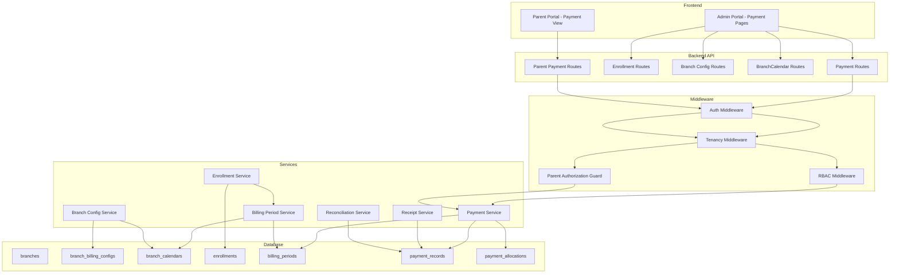

# Design Document: Payment Management

## Overview

The Payment Management module extends the EduNest school management platform with a branch-level billing and payment collection system for Algerian kindergartens. It replaces the existing school-level `invoices`/`cash_payments` model with a per-enrollment, period-based billing system that:

- Generates billing periods automatically at enrollment creation (no batch jobs)
- Records payments through an append-only ledger (no updates/deletes)
- Derives period status from the ledger on each read (no stored status column)
- Supports three offline payment channels: cash, CCP (Algérie Poste), BaridiMob
- Provides parents with a read-only portal view of their children's financial state
- Keeps payment status purely informational (never gates attendance or features)

All monetary amounts are in DZD (Algerian Dinar) with exactly two decimal places.

### Design Decisions

1. **Supersede `invoices`/`cash_payments`**: The existing invoice-based model (mutable status, Chargily gateway, `remaining_amount` updates) conflicts fundamentally with the append-only ledger approach. The new model supersedes it entirely. Existing tables are left in place but deprecated; new enrollments use only `billing_periods` and `payment_records`. Chargily Pay integration is deferred to v2 as an additional channel.

2. **Branch as a new entity**: `Branch` is introduced by this module's migration. For single-location schools, a default Branch is auto-created during migration, and the existing `School` record maps 1:1 to that Branch.

3. **On-read status derivation (no cache)**: Period status is derived from the ledger on every read. Given the low volume of kindergarten payments (tens of periods per child, dozens of children per branch), caching adds complexity without measurable benefit. If latency becomes an issue at scale, a materialized-view approach can be added without changing the API contract.

4. **ParentChildLink reuse**: The existing `parent_child_links` table fulfills the ChildParent requirement. No new join table is needed.

5. **Academic_Year end date**: The existing `academic_years.end_date` field is used as the monthly generation upper bound.

## Architecture



### Module Structure

```
backend/src/modules/payments/
├── payments.routes.ts          # Staff payment endpoints
├── payments.controller.ts      # Request handlers
├── payments.service.ts         # Payment recording, corrections, ledger
├── payments.schema.ts          # Zod validation schemas
├── payments.types.ts           # TypeScript interfaces
├── enrollment.routes.ts        # Enrollment CRUD + generation
├── enrollment.controller.ts
├── enrollment.service.ts       # Enrollment + billing period generation
├── branch-config.routes.ts     # Branch billing configuration
├── branch-config.controller.ts
├── branch-config.service.ts
├── branch-calendar.routes.ts   # BranchCalendar CRUD
├── branch-calendar.controller.ts
├── branch-calendar.service.ts
├── billing-period.service.ts   # Period generation logic, status derivation
├── parent-portal.routes.ts     # Parent read-only endpoints
├── parent-portal.controller.ts
├── parent-guard.middleware.ts  # Parent Authorization Guard
├── receipt.service.ts          # Receipt document generation
├── reconciliation.service.ts   # Reconciliation report generation
└── notification.service.ts     # Optional payment notifications
```

## Components and Interfaces

### API Endpoints

#### Branch Billing Configuration

| Method | Path | Auth | Description |
|--------|------|------|-------------|
| POST | `/api/payments/branches/:branchId/config` | Staff | Create billing config |
| PUT | `/api/payments/branches/:branchId/config` | Staff | Update billing config |
| GET | `/api/payments/branches/:branchId/config` | Staff | Get billing config |

#### BranchCalendar

| Method | Path | Auth | Description |
|--------|------|------|-------------|
| GET | `/api/payments/branches/:branchId/calendar` | Staff | List calendar entries |
| POST | `/api/payments/branches/:branchId/calendar` | Staff | Create calendar entry |
| PUT | `/api/payments/branches/:branchId/calendar/:id` | Staff | Update calendar entry |
| DELETE | `/api/payments/branches/:branchId/calendar/:id` | Staff | Delete calendar entry |

#### Enrollments

| Method | Path | Auth | Description |
|--------|------|------|-------------|
| POST | `/api/payments/enrollments` | Staff | Create enrollment + generate periods |
| GET | `/api/payments/enrollments` | Staff | List enrollments (branch-scoped) |
| GET | `/api/payments/enrollments/:id` | Staff | Get enrollment with periods |
| PATCH | `/api/payments/enrollments/:id` | Staff | Update enrollment (fee, status) |
| POST | `/api/payments/enrollments/:id/withdraw` | Staff | Withdraw enrollment |

#### Payments

| Method | Path | Auth | Description |
|--------|------|------|-------------|
| POST | `/api/payments/records` | Staff | Record payment with allocations |
| POST | `/api/payments/records/correction` | Staff | Record correction/refund |
| GET | `/api/payments/records` | Staff | List payment records (branch-scoped) |
| GET | `/api/payments/records/:id/receipt` | Staff/Parent | Generate receipt |

#### Billing Periods & Status

| Method | Path | Auth | Description |
|--------|------|------|-------------|
| GET | `/api/payments/children/:childId/periods` | Staff | List child's billing periods with derived status |
| GET | `/api/payments/children/:childId/balance` | Staff | Get child's outstanding balance |
| PATCH | `/api/payments/periods/:id/cancel` | Staff | Cancel a billing period |

#### Late Dashboard & Reports

| Method | Path | Auth | Description |
|--------|------|------|-------------|
| GET | `/api/payments/branches/:branchId/late` | Staff | Late payments dashboard |
| GET | `/api/payments/branches/:branchId/reconciliation` | Staff | Reconciliation report |

#### Parent Portal (Read-Only)

| Method | Path | Auth | Description |
|--------|------|------|-------------|
| GET | `/api/payments/parent/periods` | Parent | List linked children's billing periods |
| GET | `/api/payments/parent/history` | Parent | Payment history for linked children |
| GET | `/api/payments/parent/balances` | Parent | Outstanding balances per child |
| GET | `/api/payments/parent/receipts/:id` | Parent | View receipt |

### Service Interfaces

```typescript
// Branch Config Service
interface BranchBillingConfig {
  branchId: string;
  billingCycle: 'monthly' | 'trimester' | 'custom';
  billingDueDay: number;       // 1-28
  gracePeriodDays: number;     // 0-60, default 5
  defaultRecurringFee: Decimal; // 0.00 - 9,999,999.99
  notificationSetting: 'enabled' | 'disabled';
}

// Enrollment Service
interface CreateEnrollmentInput {
  childId: string;
  branchId: string;
  academicYearId: string;
  startDate: Date;
  recurringFee?: Decimal;       // defaults to branch config
  registrationFee?: Decimal | null;
  firstPeriodAmountDue?: Decimal; // mid-cycle override
}

interface EnrollmentGenerationResult {
  enrollmentId: string;
  periodsCreated: number;
  earliestPeriodStart: Date;
  latestPeriodEnd: Date;
  totalAmountDue: Decimal;
}

// Payment Service
interface RecordPaymentInput {
  childId: string;
  totalAmount: Decimal;
  channel: 'cash' | 'ccp' | 'baridimob';
  valueDate: Date;
  recordedBy: string;
  referenceNote?: string;
  isCorrection: false;
  allocations: PaymentAllocationInput[];
}

interface PaymentAllocationInput {
  billingPeriodId: string;
  amount: Decimal;
}

interface RecordCorrectionInput {
  childId: string;
  totalAmount: Decimal;           // negative
  channel: 'cash' | 'ccp' | 'baridimob';
  valueDate: Date;
  recordedBy: string;
  referenceNote: string;          // required for corrections
  isCorrection: true;
  correctsPaymentId: string;
  allocations: PaymentAllocationInput[]; // negative amounts
}

// Billing Period Service
interface DerivedPeriodStatus {
  status: 'unpaid' | 'partial' | 'late_partial' | 'late' | 'paid';
  isLate: boolean;
  totalPaid: Decimal;
  outstanding: Decimal;
}

// Reconciliation Service
interface ReconciliationReport {
  branchId: string;
  rangeStart: Date;
  rangeEnd: Date;
  channels: {
    cash: ChannelSummary;
    ccp: ChannelSummary;
    baridimob: ChannelSummary;
  };
  grandTotal: Decimal;
}

interface ChannelSummary {
  total: Decimal;
  paymentCount: number;
  correctionCount: number;
}
```

### Parent Authorization Guard

```typescript
// parent-guard.middleware.ts
async function parentAuthorizationGuard(
  req: Request, res: Response, next: NextFunction
): Promise<void> {
  // 1. Verify user is authenticated and has 'parent' role
  // 2. Resolve ChildParent links from DB using session user ID (not from request)
  // 3. Store resolved childIds on req for downstream use
  // 4. If request references a childId, verify it exists in resolved set
  // 5. Reject with uniform auth error if any check fails
}
```

## Data Models

### New Prisma Schema Additions

```prisma
// ─── Payment Management ──────────────────────────────────────────────────────

model Branch {
  id            String   @id @default(uuid())
  schoolId      String   @map("school_id")
  name          String
  address       String?
  isActive      Boolean  @default(true) @map("is_active")
  deletedAt     DateTime? @map("deleted_at")
  createdAt     DateTime @default(now()) @map("created_at")

  school        School   @relation(fields: [schoolId], references: [id])
  billingConfig BranchBillingConfig?
  calendars     BranchCalendar[]
  enrollments   Enrollment[]

  @@index([schoolId])
  @@index([deletedAt])
  @@map("branches")
}

enum BillingCycleType {
  monthly
  trimester
  custom
}

enum NotificationSettingType {
  enabled
  disabled
}

model BranchBillingConfig {
  id                  String              @id @default(uuid())
  branchId            String              @unique @map("branch_id")
  billingCycle        BillingCycleType    @map("billing_cycle")
  billingDueDay       Int                 @map("billing_due_day") // 1-28
  gracePeriodDays     Int                 @default(5) @map("grace_period_days") // 0-60
  defaultRecurringFee Decimal             @map("default_recurring_fee") @db.Decimal(10, 2)
  notificationSetting NotificationSettingType @default(disabled) @map("notification_setting")
  createdAt           DateTime            @default(now()) @map("created_at")
  updatedAt           DateTime            @updatedAt @map("updated_at")

  branch Branch @relation(fields: [branchId], references: [id])

  @@map("branch_billing_configs")
}

model BranchCalendar {
  id             String   @id @default(uuid())
  branchId       String   @map("branch_id")
  academicYearId String   @map("academic_year_id")
  label          String   // 1-100 chars
  periodStart    DateTime @map("period_start") @db.Date
  periodEnd      DateTime @map("period_end") @db.Date
  dueDate        DateTime @map("due_date") @db.Date
  createdAt      DateTime @default(now()) @map("created_at")
  updatedAt      DateTime @updatedAt @map("updated_at")

  branch       Branch       @relation(fields: [branchId], references: [id])
  academicYear AcademicYear @relation(fields: [academicYearId], references: [id])

  @@index([branchId, academicYearId])
  @@map("branch_calendars")
}

enum EnrollmentStatus {
  active
  withdrawn
  completed
}

model Enrollment {
  id               String           @id @default(uuid())
  childId          String           @map("child_id")
  branchId         String           @map("branch_id")
  academicYearId   String           @map("academic_year_id")
  startDate        DateTime         @map("start_date") @db.Date
  status           EnrollmentStatus @default(active)
  registrationFee  Decimal?         @map("registration_fee") @db.Decimal(10, 2)
  recurringFee     Decimal          @map("recurring_fee") @db.Decimal(10, 2)
  withdrawalDate   DateTime?        @map("withdrawal_date") @db.Date
  createdAt        DateTime         @default(now()) @map("created_at")
  updatedAt        DateTime         @updatedAt @map("updated_at")

  child          Child          @relation(fields: [childId], references: [id])
  branch         Branch         @relation(fields: [branchId], references: [id])
  academicYear   AcademicYear   @relation(fields: [academicYearId], references: [id])
  billingPeriods BillingPeriod[]

  @@unique([childId, academicYearId])
  @@index([branchId, academicYearId])
  @@index([childId])
  @@map("enrollments")
}

model BillingPeriod {
  id                   String    @id @default(uuid())
  enrollmentId         String    @map("enrollment_id")
  periodStart          DateTime  @map("period_start") @db.Date
  periodEnd            DateTime  @map("period_end") @db.Date
  dueDate              DateTime  @map("due_date") @db.Date
  graceEndDate         DateTime  @map("grace_end_date") @db.Date
  amountDue            Decimal   @map("amount_due") @db.Decimal(10, 2)
  isRegistrationPeriod Boolean   @default(false) @map("is_registration_period")
  cancelledAt          DateTime? @map("cancelled_at")
  createdAt            DateTime  @default(now()) @map("created_at")

  enrollment          Enrollment          @relation(fields: [enrollmentId], references: [id])
  paymentAllocations  PaymentAllocation[]

  @@index([enrollmentId])
  @@index([dueDate])
  @@index([cancelledAt])
  @@map("billing_periods")
}

enum PaymentChannel {
  cash
  ccp
  baridimob
}

model PaymentRecord {
  id                String         @id @default(uuid())
  branchId          String         @map("branch_id")
  childId           String         @map("child_id")
  receiptNumber     String         @unique @map("receipt_number")
  totalAmount       Decimal        @map("total_amount") @db.Decimal(10, 2)
  channel           PaymentChannel
  valueDate         DateTime       @map("value_date") @db.Date
  recordedBy        String         @map("recorded_by")
  referenceNote     String?        @map("reference_note")
  isCorrection      Boolean        @default(false) @map("is_correction")
  correctsPaymentId String?        @map("corrects_payment_id")
  createdAt         DateTime       @default(now()) @map("created_at")

  branch            Branch          @relation(fields: [branchId], references: [id])
  child             Child           @relation(fields: [childId], references: [id])
  recorder          User            @relation("PaymentRecorder", fields: [recordedBy], references: [id])
  correctedPayment  PaymentRecord?  @relation("PaymentCorrections", fields: [correctsPaymentId], references: [id])
  corrections       PaymentRecord[] @relation("PaymentCorrections")
  allocations       PaymentAllocation[]

  @@index([branchId, valueDate])
  @@index([childId])
  @@index([correctsPaymentId])
  @@map("payment_records")
}

model PaymentAllocation {
  id              String   @id @default(uuid())
  paymentRecordId String   @map("payment_record_id")
  billingPeriodId String   @map("billing_period_id")
  amount          Decimal  @db.Decimal(10, 2)
  createdAt       DateTime @default(now()) @map("created_at")

  paymentRecord PaymentRecord @relation(fields: [paymentRecordId], references: [id])
  billingPeriod BillingPeriod @relation(fields: [billingPeriodId], references: [id])

  @@unique([paymentRecordId, billingPeriodId])
  @@index([billingPeriodId])
  @@map("payment_allocations")
}

model PaymentAuditEntry {
  id            String   @id @default(uuid())
  branchId      String   @map("branch_id")
  paymentRecordId String @map("payment_record_id")
  action        String   // 'payment_recorded' | 'correction_recorded'
  performedBy   String   @map("performed_by")
  metadata      Json?
  createdAt     DateTime @default(now()) @map("created_at")

  @@index([branchId, createdAt])
  @@index([paymentRecordId])
  @@map("payment_audit_entries")
}
```

### Receipt Number Generation

Receipt numbers follow the format `{BRANCH_CODE}-{YYYY}-{SEQ}` where:
- `BRANCH_CODE`: First 3 chars of branch name uppercased
- `YYYY`: Year of value date
- `SEQ`: Auto-incrementing sequence per branch per year, zero-padded to 6 digits

Uniqueness is enforced by the database unique constraint on `receipt_number`. Concurrent inserts use a database sequence or `SELECT ... FOR UPDATE` on a counter row to prevent collisions.

### Migration Strategy

1. Add `Branch` model with a migration that creates a default branch for each existing school
2. Add all payment management tables
3. Map existing `parent_child_links` as the ChildParent relationship (already exists)
4. Deprecate but do not drop `invoices`, `cash_payments`, `payment_audit_logs`
5. Add `branchId` to `User` model (nullable) for branch-scoped staff

### Period Status Derivation Logic

```typescript
function derivePeriodStatus(
  amountDue: Decimal,
  totalPaid: Decimal,
  graceEndDate: Date,
  currentDate: Date,
  cancelledAt: Date | null
): DerivedPeriodStatus {
  const isAfterGrace = currentDate > graceEndDate;
  const outstanding = amountDue.minus(totalPaid);

  let status: PeriodStatus;
  if (totalPaid.gte(amountDue)) {
    status = 'paid';
  } else if (totalPaid.gt(0)) {
    status = isAfterGrace ? 'late_partial' : 'partial';
  } else {
    status = isAfterGrace ? 'late' : 'unpaid';
  }

  const isLate = cancelledAt
    ? false
    : (status === 'late' || status === 'late_partial');

  return { status, isLate, totalPaid, outstanding };
}
```

## Correctness Properties

*A property is a characteristic or behavior that should hold true across all valid executions of a system — essentially, a formal statement about what the system should do. Properties serve as the bridge between human-readable specifications and machine-verifiable correctness guarantees.*

### Property 1: Period Status Derivation Completeness and Correctness

*For any* combination of `amountDue` (≥ 0), `totalPaid` (any value), `graceEndDate` (any date), `currentDate` (any date), and `cancelledAt` (null or any timestamp), the `derivePeriodStatus` function SHALL return exactly one of the five status values (`unpaid`, `partial`, `late_partial`, `late`, `paid`) and SHALL return `is_late = true` only when status is `late` or `late_partial` and `cancelledAt` is null, and `is_late = false` in all other cases.

**Validates: Requirements 8.1, 8.2, 8.4, 8.5, 8.6, 8.7, 8.9, 8.13, 8.14**

### Property 2: Monthly Billing Period Generation Boundaries

*For any* valid enrollment with a `monthly` billing cycle, given a `start_date` and an Academic_Year `end_date`, the number of generated recurring billing periods SHALL equal the count of distinct calendar months from the month containing `start_date` through the month containing `end_date` inclusive, each period's `period_start` SHALL be the first day of its month, each period's `period_end` SHALL be the last day of its month, and each period's `due_date` day-of-month SHALL equal the branch's `billing_due_day`.

**Validates: Requirements 4.3, 4.4**

### Property 3: Grace End Date Invariant

*For any* generated billing period, `grace_end_date` SHALL equal `due_date` plus the branch's `grace_period_days` counted as whole calendar days, including when `grace_period_days` is 0 (in which case `grace_end_date` equals `due_date`).

**Validates: Requirements 4.6, 5.4**

### Property 4: Recurring Fee as Amount Source

*For any* enrollment and any generated billing period where `is_registration_period` is false and no first-period override was stated, `amount_due` SHALL equal the enrollment's `recurring_fee` value at generation time, expressed with exactly two decimal places.

**Validates: Requirements 3.6, 4.8, 4.9**

### Property 5: Registration Period Generation

*For any* enrollment with a non-null `registration_fee`, exactly one billing period SHALL be generated with `is_registration_period = true`, its `amount_due` SHALL equal the `registration_fee`, its `period_start` and `period_end` SHALL both equal the enrollment `start_date`, its `due_date` SHALL equal the enrollment `start_date`, and its `grace_end_date` SHALL equal `start_date` plus `grace_period_days`. For any enrollment with a null `registration_fee`, no billing period with `is_registration_period = true` SHALL exist.

**Validates: Requirements 5.1, 5.2, 5.3, 5.5, 5.6, 5.7**

### Property 6: Amount Snapshot Immutability

*For any* already-generated billing period, updating the branch billing configuration (billing_cycle, billing_due_day, grace_period_days, default_recurring_fee), updating the enrollment `recurring_fee`, or updating/deleting a BranchCalendar row SHALL leave that period's `amount_due`, `due_date`, `grace_end_date`, `period_start`, and `period_end` unchanged.

**Validates: Requirements 6.1, 6.2, 6.3, 6.4, 6.5**

### Property 7: Payment Allocation Sum Equals Total

*For any* valid payment recording submission, the sum of all payment allocation amounts SHALL equal the submitted total amount. If they differ by any non-zero amount, the submission SHALL be rejected with no persistence.

**Validates: Requirements 9.4**

### Property 8: Receipt Number Uniqueness

*For any* two payment records within the same branch, their receipt numbers SHALL be distinct, including concurrent inserts and correction records.

**Validates: Requirements 9.10**

### Property 9: Outstanding Balance Formula

*For any* child, the outstanding balance SHALL equal the sum of `amount_due` over all non-cancelled billing periods minus the sum of all payment allocation amounts (including negative correction allocations) against those same periods, expressed in DZD with exactly two decimal places using half-up rounding on the final result only. A negative result (overpayment) SHALL be returned without clamping.

**Validates: Requirements 13.1, 13.2, 13.3, 13.7**

### Property 10: Correction Amount Constraint

*For any* correction payment record with `corrects_payment_id` pointing to an original record, and *for any* billing period referenced by that correction's allocations, the absolute sum of all correction allocations against that period under the same `corrects_payment_id` SHALL NOT exceed the amount the original record allocated to that period.

**Validates: Requirements 11.12, 11.17**

### Property 11: Withdrawal Cancellation Logic

*For any* enrollment withdrawal with a submitted withdrawal date, every billing period whose `period_start` is later than the withdrawal date and whose `is_registration_period` is false SHALL have `cancelled_at` set, and every billing period whose `period_end` is on or before the withdrawal date, or whose date range contains the withdrawal date, or whose `is_registration_period` is true SHALL retain `cancelled_at = null`.

**Validates: Requirements 12.1, 12.2**

### Property 12: Cancelled Period Exclusion

*For any* billing period carrying a non-null `cancelled_at`, that period SHALL be excluded from the outstanding balance calculation (both amount_due sum and total_paid sum), excluded from the late dashboard results, and SHALL have `is_late = false` regardless of its derived status.

**Validates: Requirements 8.12, 8.14, 12.5, 12.6, 14.2**

### Property 13: Reconciliation Report Consistency

*For any* branch and date range, the reconciliation report grand total SHALL equal the sum of the per-channel totals, each channel total SHALL equal the signed sum of all payment record amounts of that channel whose value date falls within the range, and each channel's payment count plus correction count SHALL equal the total number of matching records for that channel.

**Validates: Requirements 19.1, 19.2, 19.3, 19.4, 19.6**

### Property 14: Parent Authorization Isolation

*For any* authenticated parent user, every API response SHALL contain data only for children present in that parent's resolved ChildParent link set, and requests referencing a child ID not in that set SHALL be rejected with an authorization error.

**Validates: Requirements 17.4, 17.5, 17.6, 17.7, 17.8**

### Property 15: Tenant Scoping Isolation

*For any* staff user scoped to a specific branch, every query result SHALL contain only records belonging to that branch, and requests referencing records from other branches or other schools SHALL be rejected.

**Validates: Requirements 20.1, 20.2, 20.3, 20.6, 20.7**

### Property 16: Ledger Append-Only Invariant

*For any* existing payment record, no operation SHALL modify any field of that record or delete it. The only mutation path for financial state is inserting a new correction payment record with `is_correction = true` and a negative amount.

**Validates: Requirements 11.1, 11.2, 11.3**

### Property 17: Trimester/Custom Period Boundaries From Calendar

*For any* enrollment at a branch with `trimester` or `custom` billing cycle, the generated billing periods' `period_start`, `period_end`, and `due_date` values SHALL match exactly the corresponding BranchCalendar rows (for rows whose `period_end` >= enrollment `start_date`), taken in ascending `period_start` order with no date transformation.

**Validates: Requirements 2.2, 4.5**

### Property 18: Conditional Reference Note Requirement

*For any* payment record where the channel is `ccp` or `baridimob`, `reference_note` SHALL be non-empty (1-500 chars after trim). For any correction payment record (`is_correction = true`), `reference_note` SHALL be non-empty regardless of channel.

**Validates: Requirements 10.3, 11.7**

## Error Handling

### Validation Errors (HTTP 400)

All validation errors follow the existing EduNest pattern using Zod schemas:

```json
{
  "success": false,
  "error": {
    "code": "VALIDATION_ERROR",
    "message": "Request body validation failed",
    "details": [
      { "field": "billingCycle", "message": "Must be one of: monthly, trimester, custom" },
      { "field": "billingDueDay", "message": "Must be a whole number between 1 and 28" }
    ]
  }
}
```

### Authorization Errors (HTTP 403)

```json
{
  "success": false,
  "error": {
    "code": "FORBIDDEN",
    "message": "This operation is restricted to Staff users"
  }
}
```

### Business Rule Violations (HTTP 409/422)

For append-only violations, immutability violations, and constraint failures:

```json
{
  "success": false,
  "error": {
    "code": "LEDGER_IMMUTABLE",
    "message": "Payment records cannot be modified. Use a correction record instead."
  }
}
```

### Error Categories

| Category | HTTP Status | Code | Example |
|----------|-------------|------|---------|
| Input validation | 400 | VALIDATION_ERROR | Invalid billing_due_day |
| Auth/AuthZ | 401/403 | UNAUTHORIZED / FORBIDDEN | Non-staff user |
| Not found | 404 | NOT_FOUND | Period ID not found |
| Conflict | 409 | CONFLICT | Duplicate enrollment |
| Business rule | 422 | BUSINESS_RULE_VIOLATION | Correction exceeds original |
| Immutability | 422 | LEDGER_IMMUTABLE | Attempted update to payment |
| Generation failure | 422 | GENERATION_FAILED | No calendar rows for period |

### Transaction Rollback

All multi-write operations (enrollment + periods, payment + allocations) use Prisma interactive transactions. On any failure within the transaction, the entire operation rolls back and returns the appropriate error code. No partial state is ever committed.

## Testing Strategy

### Property-Based Testing

**Library:** `fast-check` (via `vitest` test runner already configured in the project)

**Configuration:**
- Minimum 100 iterations per property test
- Each test tagged with: `Feature: payment-management, Property {N}: {title}`

**Key property tests to implement:**

1. **Period status derivation** (Property 1): Generate random tuples of (amountDue, totalPaid, graceEndDate, currentDate, cancelledAt) and verify the derivation function returns correct status.

2. **Monthly generation** (Property 2): Generate random (startDate, endDate, billingDueDay) and verify period count and boundaries.

3. **Grace end date** (Property 3): Generate random (dueDate, gracePeriodDays) and verify grace_end_date calculation.

4. **Amount source** (Property 4): Generate random recurring fees and verify all non-registration periods use that value.

5. **Registration period** (Property 5): Generate random enrollments with/without registration fee, verify conditional generation.

6. **Immutability** (Property 6): Generate periods, apply config/fee updates, verify period fields unchanged.

7. **Allocation sum** (Property 7): Generate random allocation sets, verify sum constraint enforcement.

8. **Balance formula** (Property 9): Generate random periods and payments, verify balance = sum(due) - sum(paid).

9. **Correction constraint** (Property 10): Generate corrections against originals, verify magnitude limit.

10. **Withdrawal cancellation** (Property 11): Generate enrollments with multiple periods, apply withdrawal at random dates, verify correct periods cancelled.

11. **Reconciliation consistency** (Property 13): Generate random payments, verify grand total = sum of channel totals.

### Unit Tests (Example-Based)

- Default grace_period_days = 5 when omitted
- Default recurring_fee fallback to branch config
- Rejection of enrollment when branch has no billing config
- Trimester requires exactly 3 calendar rows
- First-period override rejected when start_date = period_start
- Cancelled period included in history with label
- Empty state for parent with no linked children

### Integration Tests

- Transaction atomicity: enrollment + period generation
- Transaction atomicity: payment record + allocations
- Audit entry creation on payment insert
- Payment status does not block attendance check-in
- Notification dispatch failure doesn't affect payment recording

### End-to-End Tests

- Full enrollment → payment → receipt → reconciliation flow
- Parent portal displays correct periods and balances
- Withdrawal flow cancels correct periods and adjusts balance

